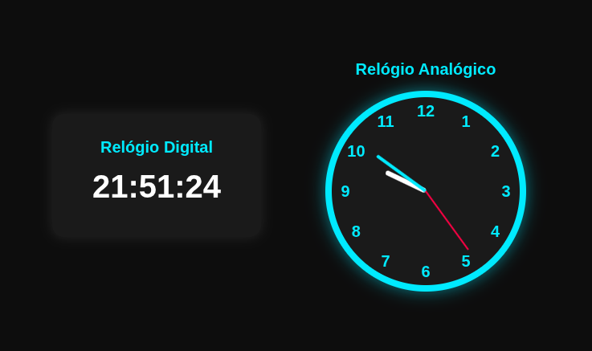

# Relógio Digital e Analógico

Projeto feito para a prática e estudo em HTML, CSS e JavaScript.

  <a href="#-tecnologias">Tecnologias</a>&nbsp;&nbsp;&nbsp;|&nbsp;&nbsp;&nbsp;
  <a href="#-projeto">Projeto</a>&nbsp;&nbsp;&nbsp;|&nbsp;&nbsp;&nbsp;
  <a href="#-youtube">YouTube</a>&nbsp;&nbsp;&nbsp;|&nbsp;&nbsp;&nbsp;
  <a href="#Licença">Licença</a>

  

 

  

## 🚀 Tecnologias

Esse projeto foi desenvolvido com as seguintes tecnologias:

- HTML
- CSS
- JavaScript

## 💻 Projeto

Este projeto apresenta a implementação de um relógio digital e analógico utilizando HTML, CSS e JavaScript.
No relógio digital, é aplicada a formatação adequada do horário, garantindo duas casas decimais. Já no relógio analógico, são utilizados cálculos de angulação e a propriedade transform do CSS para posicionar corretamente os ponteiros conforme o tempo atual.

## Youtube

Veja também o passo a passo no [YouTube](https://youtu.be/oTVM_2zAOYA).

## Licença

Esse projeto está sob a licença MIT.

---
