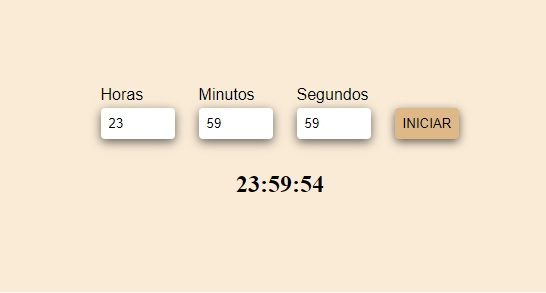

# Contagem Regressiva

Nesse site é possível colocar um tempo de até 24h para que ele faça a contagem regressiva desse tempo

## Tecnologias 💻

- HTML
- CSS
- JAVASCRIPT

## 📂 Passo a Passo

Acompanhe o passo a passo nesse link do youtube.

[Jackson Gravino Dev](https://www.youtube.com/watch?v=3BW7xWeNYh8)
