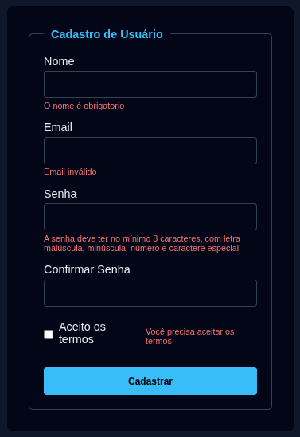

# Formulario_YT

Projeto simples em HTML, CSS e JavaScript que demonstra a validação de um formulário de cadastro de usuário. Ideal para praticar manipulação de DOM e exibição de mensagens de erro.

## 📌 Descrição

O objetivo deste repositório é apresentar um formulário com campos básicos (nome, e-mail, senha e confirmação de senha) e um checkbox para aceitação dos termos. Utiliza JavaScript para validar as entradas e mostrar feedbacks na interface.

## 🚀 Funcionalidades

- Validação de campos obrigatórios
- Verificação de formato de e-mail
- Confirmação de senha (senha e confirmar senha devem coincidir)
- Checkbox de termos obrigatório
- Exibição de mensagens de erro abaixo de cada campo

## 🛠 Tecnologias

O projeto foi construído com:

- HTML5
- CSS3
- JavaScript

---

## 📂 Passo a Passo

Acompanhe o passo a passo nesse link do youtube.

[Jackson Gravino Dev](https://www.youtube.com/watch?v=AIbZiPTczYw)

## 📝 Licença

Este projeto está sob a licença MIT.
