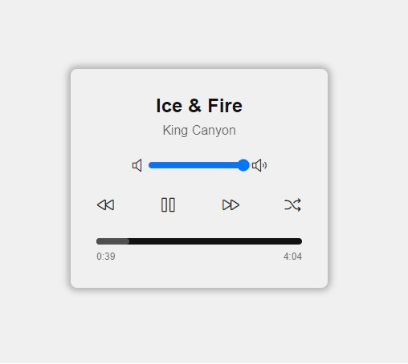

# Player de Música

player de música simples com o nome da música, o nome da banda, um controlador de volume, botão de play/pause, passar a música para frente, voltar a música e escolher uma música aleatória.

## Tecnologias

- HTML
- CSS
- JavaScript

## 📂 Passo a Passo

Acompanhe o passo a passo nesse link do youtube.

[Jackson Gravino Dev](https://www.youtube.com/watch?v=XOAHeKy7wY4)

---

