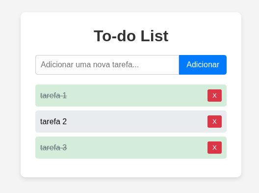

# To-Do

Projeto simples em HTML, CSS e JavaScript de uma To-Do List (Lista de Tarefas) persistente, utilizando o LocalStorage

## 🛠 Tecnologias

O projeto foi construído com:

- HTML
- CSS
- JavaScript

## 📂 Passo a Passo

Acompanhe o passo a passo nesse link do youtube.

[Jackson Gravino Dev](https://youtu.be/ffY1y52itqo)

